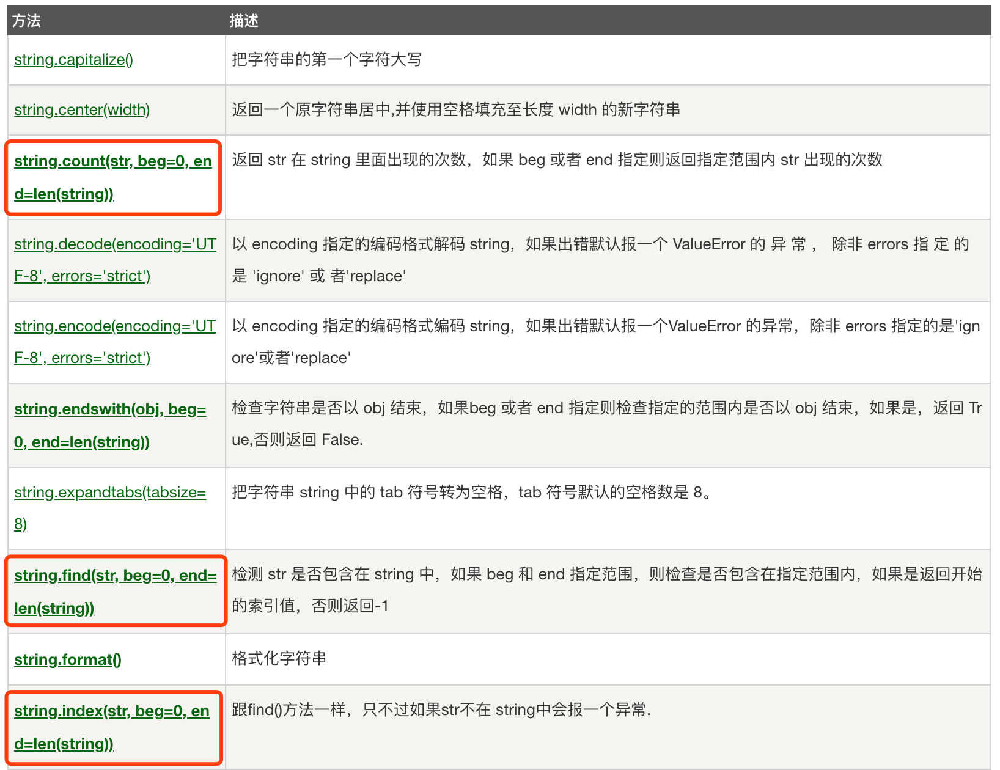
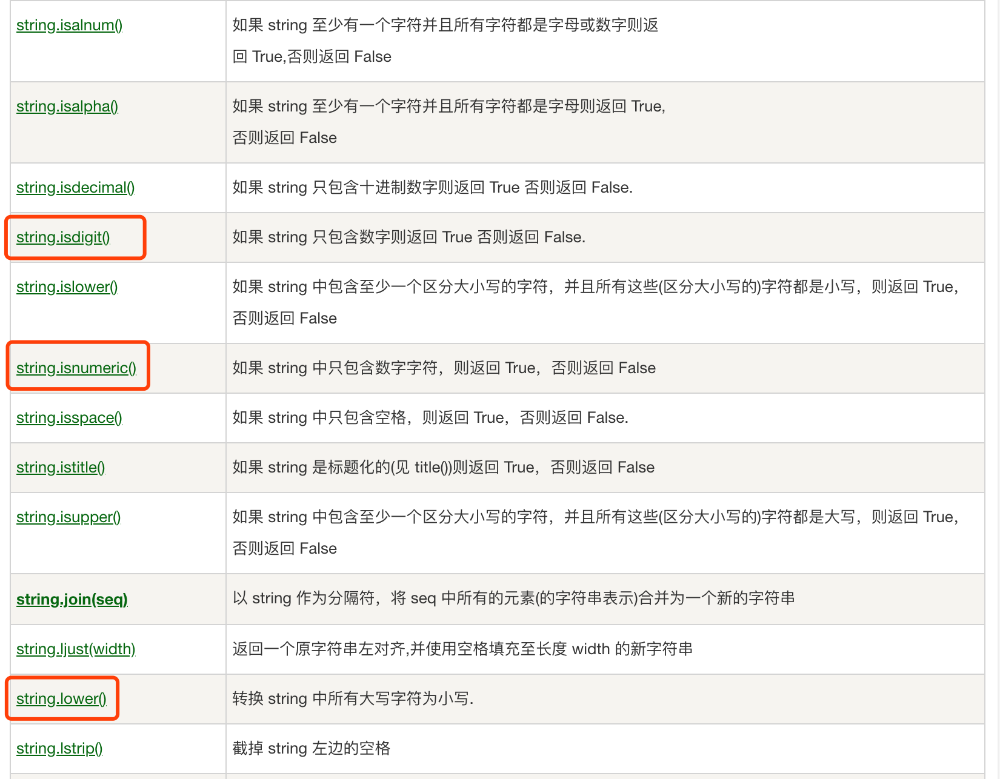
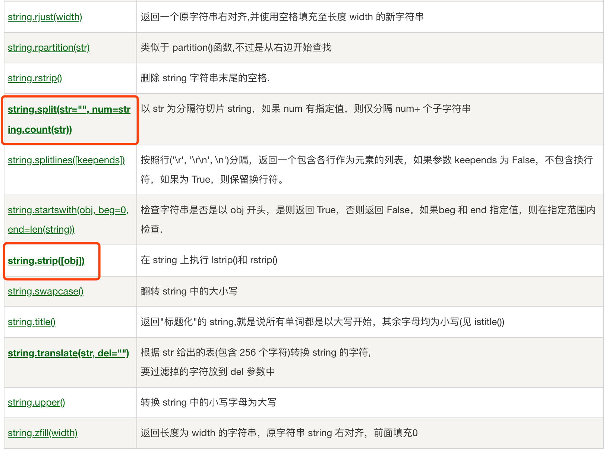
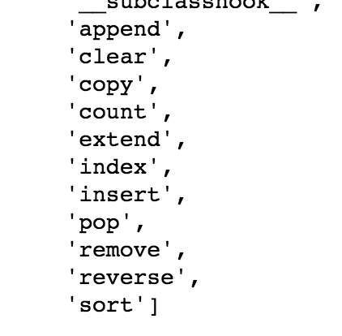
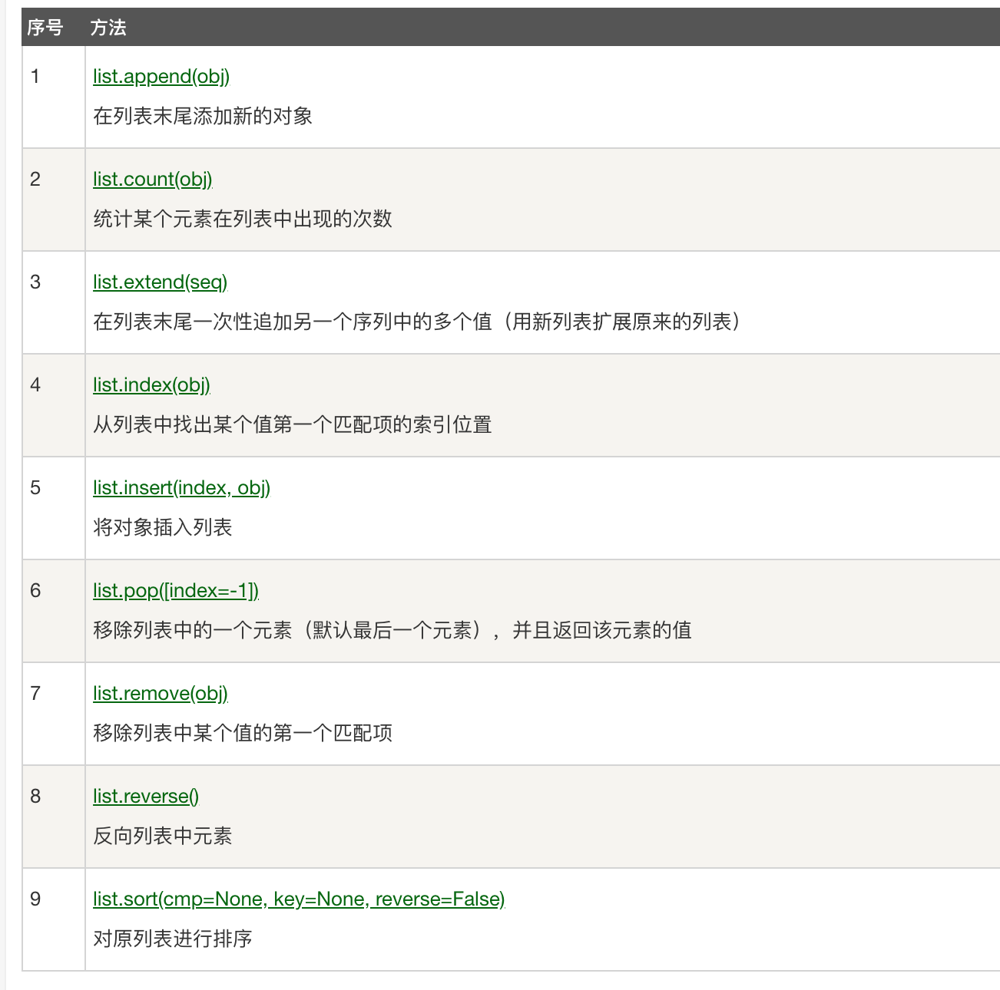
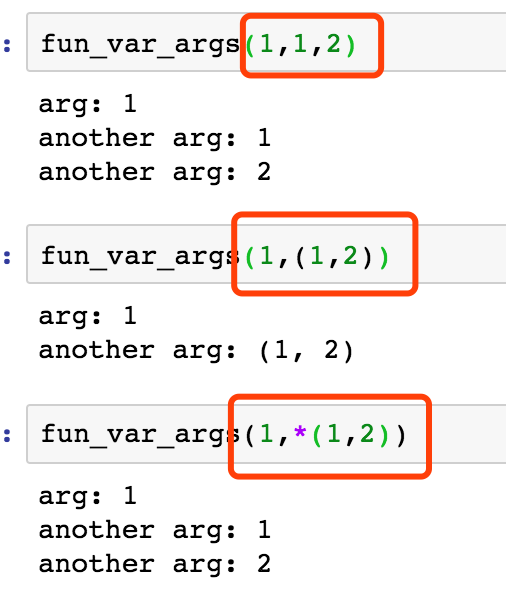
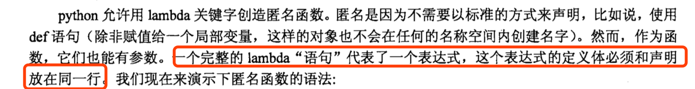
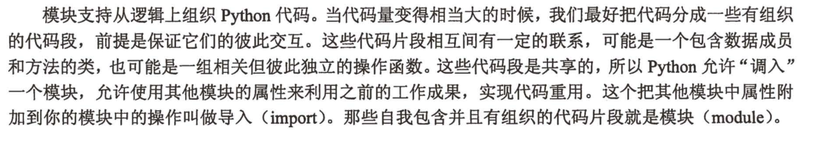
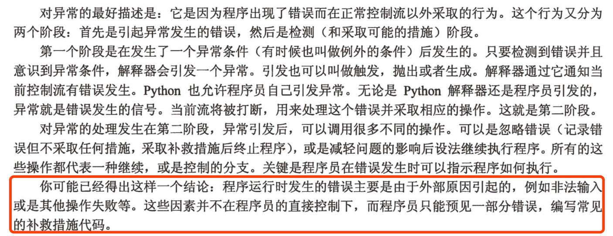

<!-- TOC -->autoauto- [1. Python知识点](#1-python知识点)auto    - [1.1. Python基础](#11-python基础)auto        - [1.1.1. 字符串](#111-字符串)auto        - [1.1.2. List](#112-list)auto        - [1.1.3. 元祖(Tuple)](#113-元祖tuple)auto        - [1.1.4. Dict(字典类)](#114-dict字典类)auto        - [1.1.5. 函数与函数式编程](#115-函数与函数式编程)auto        - [1.1.6. Python模块](#116-python模块)auto        - [1.1.7. Python异常](#117-python异常)auto        - [1.1.8. Python面向对象编程](#118-python面向对象编程)auto        - [1.1.9. Python列表推导式与生成式](#119-python列表推导式与生成式)auto        - [1.1.10. Python装饰器](#1110-python装饰器)autoauto<!-- /TOC -->
# 1. Python知识点
## 1.1. Python基础
### 1.1.1. 字符串  
- 字符串表示
```python
a1 = 'string1'
a2 = "string2"
'''
多行注释字符串
'''
print(a1[0])
## 字符串可像列表一样取值，切片

a1[0] = r
## 字符串不可变对象，抛出异常
```
- 字符串常见操作  




### 1.1.2. List  
- 有序列表，元素类型不固定，长度不固定，都可以进行的操作包括索引，切片，加，乘，检查成员
```Python
lst = [1,2,3,4,5]
dir(lst)
```

- 注意append方法和extend方法的区别
- sort方法的使用
```python
lst = ['aa','bb','cc','dd','ee']
lst.sort(key=lambda x:x[0])
```
- List对象的内置方法

### 1.1.3. 元祖(Tuple)  
- 元祖不能修改元祖元素，例如：
```
ttuple = (1,2,3)
ttuple[2] = 3#抛出异常
```
- 元祖其他用法和列表类似

### 1.1.4. Dict(字典类)

### 1.1.5. 函数与函数式编程
- 函数参数：  
Python支持函数参数的写法包括：顺序传入参数，含有默认值的参数，不定长元祖参数（*args），字典参数(*kwargs)
- - 不定长元祖参数详解
```Python
def fun_var_args(farg, *args):
    print("arg:", farg)
    for value in args:
        print("another arg:", value)
```


注意三种传参用法的区别，第二种将tuple(1,2)当做一个参数，而第三种将tuple当做一个参数列表传入
- - 字典参数详解
```Python
def fun_var_kwargs(farg, **kwargs):
    print ("arg:", farg)
    for key in kwargs:
        print ("another keyword arg: %s: %s" % (key, kwargs[key]))
fun_var_kwargs(1,**{"1":"2","2":"3"})
#same as fun_var_kwargs(farg=1,**{"1":"2","2":"3"})
#result:
#another keyword arg: 1: 2
#another keyword arg: 2: 3
```
- 函数式编程
- - 传递函数及函数作参数  
Python中函数可以作为值进行传递，可以理解为C语言中的函数指针，在面向对象的编程思想中，可以理解为函数为第一类对象，每一个函数就是一个类，且拥有默认的init函数和call函数
```Python
def foo():
    print('hello')
boo = foo
boo()# hello
def foo1(func1):
    func1()
foo1(foo)#hello
```
- - 匿名函数lambda

- - Python函数式编程  
Python中支持三种内建函数，map(),filter(),reduce(),均可作用于可迭代对象（什么是可迭代对象后文解释），具体用法如下:
```Python
from functools import reduce
lst = [1,2,3,5,4,6,2,9]
# map
print(list(map(lambda x:x+1,lst)))
#filter
print(list(filter(lambda x:x%2==0,lst)))
#reduce
print(reduce(lambda x,y:x+y,lst))
#result1:[2, 3, 4, 6, 5, 7, 3, 10]
#result2:[2, 4, 6, 2]
#result3:32
```
### 1.1.6. Python模块
- 定义

在功能逻辑上上一组定义的Python函数及Python类可以看作为一个模块，在文件上，一个.py文件可以看成一个Python模块，都可以通过import方法导入。
- 导入  
```Python
import numpy
import pandas as pd
import numpy as np,pandas as pd
from sklearn.linear_model import LinearRegression as lr
from sklearn.linear_model import LinearRegression as lr,bayes as by ,LogisticRegression as lgr
```
- 导入和加载
模块被导入是，模块就会被加载，同时模块的顶层代码会被执行（没有包含于任何类或函数的代码），包括设定一些模块中的全局变量等。  
一个模块只会被加载一次无论它被import多少次，例如模块a.py和模块b.py都import了sys模块，但是a.py导入时加载了sys模块，b.py导入时不会再加载sys  
- **尽量避免使用**from module import *
- Python包
为了避免模块名冲突，Python又引入了按目录来组织模块的方法，称为包（Package）。
举个例子，一个abc.py的文件就是一个名字叫abc的模块，一个xyz.py的文件就是一个名字叫xyz的模块。
现在，假设我们的abc和xyz这两个模块名字与其他模块冲突了，于是我们可以通过包来组织模块，避免冲突。方法是选择一个顶层包名，比如mycompany，按照如下目录存放：
引入了包以后，只要顶层的包名不与别人冲突，那所有模块都不会与别人冲突。现在，abc.py模块的名字就变成了mycompany.abc，类似的，xyz.py的模块名变成了mycompany.xyz。
每一个包目录下面都会有一个__init__.py的文件，这个文件是必须存在的，否则，Python就把这个目录当成普通目录，而不是一个包。__init__.py可以是空文件，也可以有Python代码，因为__init__.py本身就是一个模块，而它的模块名就是mycompany。
包可以有多级目录，组成多级层次的包结构。
```
mycompany
├─ __init__.py
├─ abc.py
└─ xyz.py

mycompany
 ├─ web
 │  ├─ __init__.py
 │  ├─ utils.py
 │  └─ www.py
 ├─ __init__.py
 ├─ abc.py
 └─ xyz.py
```
### 1.1.7. Python异常
- 异常的定义(来自CorePython)

主要目的是为了在开发人员推测可能发生错误的时候采取相应的补救措施。
- Python异常处理的方法
```Python
try:
     <语句>
except <异常名1>:
      print('异常说明1')
except <异常名2>:
      print('异常说明2')
except <异常名3>:
      traceback.print_exc(file=open('tb.txt','w+'))#打印完整异常栈
else:
      doSomething()#未捕获异常执行
finally:
      pass#无论如何最后都会执行
```
- 自定义异常
```Python
#继承异常类
class MyError(Exception):
    def __init__(self, value):
        self.value = value
    def __str__(self):
        return repr(self.value)

try:
    raise MyError(2*2)
except MyError as e:
    print('My exception occurred, value:', e.value)
```
- 断言语法Assert
assert断言等价于
```Python
if express not true:
    raise AssertionError
```
常见的写法包括
```Python
assert True     # 条件为 true 正常执行
assert False    # 条件为 false 触发异常
Traceback (most recent call last):
  File "<stdin>", line 1, in <module>
AssertionError
assert 1==1    # 条件为 true 正常执行
assert 1==2    # 条件为 false 触发异常
Traceback (most recent call last):
  File "<stdin>", line 1, in <module>
AssertionError

assert 1==2, '1 不等于 2'
Traceback (most recent call last):
  File "<stdin>", line 1, in <module>
AssertionError: 1 不等于 2
```
### 1.1.8. Python面向对象编程

### 1.1.9. Python列表推导式与生成式

### 1.1.10. Python装饰器


